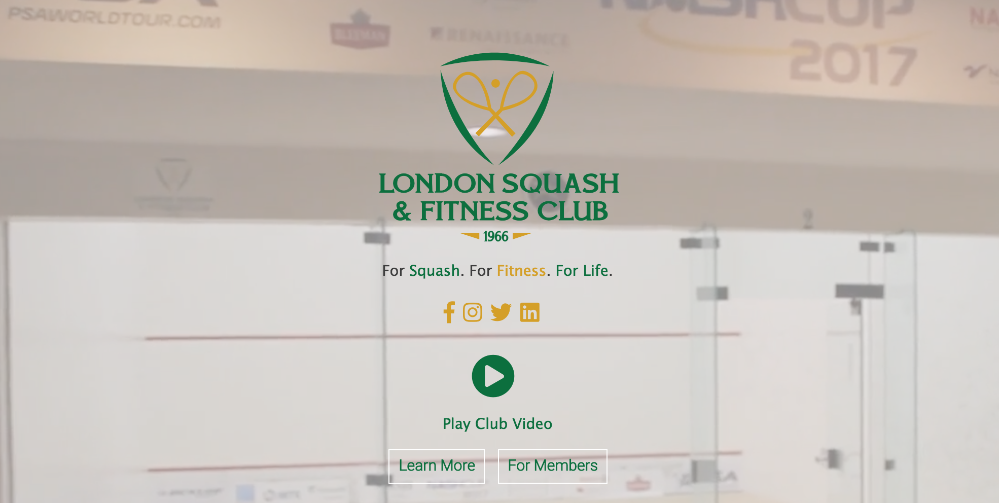

# London Squash and Fitness Club Website

My website redesign for the London Squash and Fitness Club, built on [a Bootstrap Hair Salon Website Theme](https://easetemplate.com/downloads/men-hair-salon-bootstrap-responsive-website-templates/). 

This website redesign was selected as the winner by the client in a Fanshawe Interactive Media Design student competition. 

Live at [lsrc.ca](https://www.lsrc.ca) and hosted with [Netlify](http://netlify.com/). 

## Getting Started

To locally host this website, you’ll need Git installed on your computer.
[See detailed install instructions here.](https://gist.github.com/derhuerst/1b15ff4652a867391f03)

## Built With

* [Bootstrap 3](https://getbootstrap.com/)
* [Javascript](https://www.javascript.com/) - Used for video player 

## To-Do List
 
- [ ] Create content management system backend with DatoCMS
- [ ] Use PHP with forms rather than working with Netlify
- [ ] Improve spam filters on forms 
- [ ] Add photo gallery page  

## Authors

* [**Emma Blue**](https://github.com/EmmaBlue) - *Developer*

## License

This project is licensed under the [MIT License](https://opensource.org/licenses/MIT/).